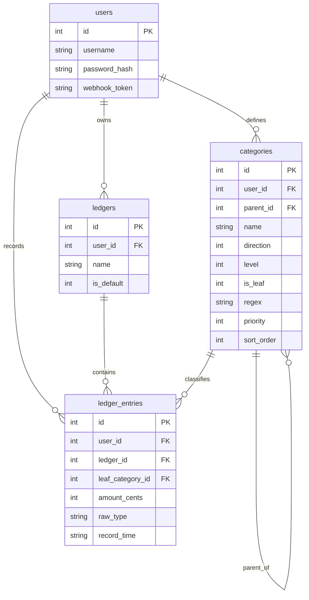

# Almanac Ledger 数据模型设计文档 v1.2

> 上游依据：`docs/ledger_requirements.md` (v1.5)、`docs/ledger_interaction_design.md` (v1.0)
> 本文从交互设计反推数据实体，定义表结构、约束、索引与关系。所有关键决策已落定（见第 5 节）。

## 1. 设计原则

- **交互驱动**：实体字段来自各页面/链路的读写诉求，非凭空建模。
- **多用户隔离**：所有业务表携带 `user_id`，查询强制按用户过滤。
- **金额精度与方向**：金额以「整数分」**带符号**存储（`INTEGER`）。支出为负、收入为正，¥19.90 支出存为 `-1990`。方向即符号，账目表不再单设 direction 字段。
- **元→分转换**：所有输入来源（webhook / manual / csv）传入的金额均为元（小数，如 -19.9），入库前统一由**应用层（Go）四舍五入到分**转成整数（`round(amount * 100)`），避免浮点误差。
- **树结构**：分类采用邻接表（`parent_id` 自引用），配合 SQLite 递归 CTE 做多级汇总。层级 ≤ 5。
- **时间精度与格式**：记账时间精确到分，统一东八区，采用定长 ISO 文本 `YYYY-MM-DD HH:mm`（字典序 = 时间序，排序无忧）。

## 2. 实体关系概览



## 3. 表结构详设

### 3.1 `users`（用户表）
| 字段 | 类型 | 约束 | 说明 |
| :--- | :--- | :--- | :--- |
| `id` | INTEGER | PK AUTOINCREMENT | |
| `username` | TEXT | UNIQUE NOT NULL | 登录用户名 |
| `password_hash` | TEXT | NOT NULL | 密码哈希（bcrypt/argon2） |
| `webhook_token` | TEXT | UNIQUE NOT NULL | Webhook 鉴权令牌，可重置 |
| `created_at` | DATETIME | DEFAULT CURRENT_TIMESTAMP | |

- 索引：`username`、`webhook_token` 均唯一索引（登录与 Webhook 鉴权快速定位）。

### 3.2 `ledgers`（账本表，预留多账本）
| 字段 | 类型 | 约束 | 说明 |
| :--- | :--- | :--- | :--- |
| `id` | INTEGER | PK AUTOINCREMENT | |
| `user_id` | INTEGER | NOT NULL FK→users.id | 所属用户 |
| `name` | TEXT | NOT NULL DEFAULT '默认账本' | 账本名 |
| `is_default` | INTEGER | DEFAULT 1 | 是否默认账本 |
| `created_at` | DATETIME | DEFAULT CURRENT_TIMESTAMP | |

- 第一阶段每用户自动创建 1 个默认账本。该表为**前瞻预留**（决策点 A：已确认引入），使未来升级单用户多账本时无需改表结构。

### 3.3 `categories`（分类树表）
| 字段 | 类型 | 约束 | 说明 |
| :--- | :--- | :--- | :--- |
| `id` | INTEGER | PK AUTOINCREMENT | |
| `user_id` | INTEGER | NOT NULL FK→users.id | 所属用户 |
| `parent_id` | INTEGER | FK→categories.id NULL | 父分类，根节点为 NULL |
| `name` | TEXT | NOT NULL | 分类名称 |
| `direction` | INTEGER | NOT NULL | 1:收入 / -1:支出 |
| `level` | INTEGER | NOT NULL CHECK(level BETWEEN 1 AND 5) | 层级 1~5 |
| `is_leaf` | INTEGER | NOT NULL DEFAULT 1 | 是否叶子节点 |
| `regex` | TEXT | NULL | 仅叶子节点可用的匹配正则 |
| `priority` | INTEGER | NOT NULL DEFAULT 0 | 匹配优先级，越大越先 |
| `sort_order` | INTEGER | DEFAULT 0 | 同级展示排序 |
| `created_at` | DATETIME | DEFAULT CURRENT_TIMESTAMP | |

- **业务不变式**：
  - 方向继承：子节点 `direction` 必须等于父节点（应用层校验）。
  - 叶子才能配规则：`is_leaf=0` 时 `regex`/`priority` 无效。
  - 层级约束：`level = 父.level + 1`，根节点 `level=1`。
- 索引：`(user_id, parent_id)` 复合索引（树遍历）；`(user_id, is_leaf, priority)`（路由匹配时拉取叶子并排序）。

### 3.4 `ledger_entries`（账目流水表）
| 字段 | 类型 | 约束 | 说明 |
| :--- | :--- | :--- | :--- |
| `id` | INTEGER | PK AUTOINCREMENT | |
| `user_id` | INTEGER | NOT NULL FK→users.id | 所属用户 |
| `ledger_id` | INTEGER | NOT NULL FK→ledgers.id | 所属账本；入库时统一解析为该用户默认账本 id |
| `leaf_category_id` | INTEGER | FK→categories.id NULL | 归类叶子；NULL=待分类 |
| `amount_cents` | INTEGER | NOT NULL | 金额**带符号**，单位：分。支出为负、收入为正。由输入元值经应用层 `round(amount*100)` 得到。 |
| `raw_type` | TEXT | NOT NULL | Webhook 原始描述 |
| `record_time` | TEXT | NOT NULL | 记账时间（`YYYY-MM-DD HH:mm` 定长 ISO，字典序=时间序） |
| `note` | TEXT | NULL | 备注（手动记账/补充用） |
| `source` | TEXT | DEFAULT 'webhook' | 来源：webhook/manual/csv |
| `created_at` | DATETIME | DEFAULT CURRENT_TIMESTAMP | 入库时间 |

- **待分类表达**：`leaf_category_id IS NULL` 即为待分类（隐式，不单独加 status 字段）。明细页的“仅看待分类”筛选即 `WHERE leaf_category_id IS NULL`。**（决策点 D：已确认）**
- **方向判定**：**移除独立的 direction 字段**。`amount_cents` 本身带符号（负=支出、正=收入），直接用符号表达方向。统计时 `SUM(amount_cents)` 自然得出净值；支出=`SUM WHERE amount_cents < 0`、收入=`SUM WHERE amount_cents > 0`。待分类（无分类）时仍能靠符号统计收支。
- **归类校验**：账目归类到叶子后，应用层校验金额符号与叶子分类 `direction` 一致（不得把正数记到支出分类）。
- **去重依据**：CSV 导入基于 `(user_id, record_time, raw_type, amount_cents)` 查重。
- **时间排序无忧**：`record_time` 定长 ISO 文本，字典序等同时间序，`ORDER BY record_time DESC` 直接可用。**（决策点 E：已确认存文本）**
- 索引：`(user_id, record_time)`（时光轴/月份筛选）；`(user_id, leaf_category_id)`（分类汇总）；`(user_id, leaf_category_id) WHERE leaf_category_id IS NULL`（待分类快查，可选部分索引）。

## 4. 关键查询范式

### 4.1 多级报表汇总（递归 CTE）
统计某一级分类及其全部子孙的金额：
```sql
WITH RECURSIVE subtree(id) AS (
    SELECT id FROM categories WHERE id = :category_id AND user_id = :uid
    UNION ALL
    SELECT c.id FROM categories c
    JOIN subtree s ON c.parent_id = s.id
)
SELECT COALESCE(SUM(e.amount_cents), 0) AS total_cents
FROM ledger_entries e
WHERE e.user_id = :uid
  AND e.leaf_category_id IN (SELECT id FROM subtree);
```

### 4.2 路由引擎拉取叶子规则
```sql
SELECT id, regex, priority FROM categories
WHERE user_id = :uid AND is_leaf = 1 AND regex IS NOT NULL
ORDER BY priority DESC, id ASC;
```
应用层用 Go `regexp` 预编译并缓存正则，依次匹配 `raw_type`，命中即止。

### 4.3 月度收支统计
```sql
-- 本月支出（取绝对值）
SELECT -COALESCE(SUM(amount_cents), 0) AS expense_cents
FROM ledger_entries
WHERE user_id = :uid
  AND substr(record_time, 1, 7) = :month   -- '2026-07'
  AND amount_cents < 0;

-- 本月收入
SELECT COALESCE(SUM(amount_cents), 0) AS income_cents
FROM ledger_entries
WHERE user_id = :uid
  AND substr(record_time, 1, 7) = :month
  AND amount_cents > 0;

-- 结余（净值 = 收入 - 支出）
SELECT COALESCE(SUM(amount_cents), 0) AS balance_cents
FROM ledger_entries
WHERE user_id = :uid
  AND substr(record_time, 1, 7) = :month;
```
> 注：`record_time` 为定长 ISO 文本，`substr(...,1,7)` 取 `YYYY-MM` 即可按月分组（也可用 `strftime`）。

## 5. 决策点落定
| 编号 | 决策点 | 最终决策 |
| :--- | :--- | :--- |
| A | 是否现在引入 `ledgers` 表 | ✅ 引入（预留，避免后续迁移） |
| B | 金额存整数分 vs 浮点 | ✅ 整数分（amount_cents 带符号） |
| C | 树存储邻接表 vs 闭包表 | ✅ 邻接表 + 递归 CTE（5层够用） |
| D | 待分类隐式(NULL) vs 显式 status | ✅ 隐式 NULL（简洁且够用） |
| E | `record_time` 存文本 vs Unix 时间戳 | ✅ 定长 ISO 文本（字典序=时间序） |
| 新 | `direction` 字段必要性 | ✅ **移除**账目表 direction，符号即方向（categories.direction 保留） |

---
**版本说明**：
- v1.0 (2026-07-05)：决策点全部落定。金额存带符号整数分、移除账目表 direction 字段、时间存定长 ISO 文本。
- v1.1 (2026-07-05)：补 4.3 月度收支统计 SQL；`ledger_id` 定为 NOT NULL（默认账本）；明确元→分四舍五入转换；修正过时引言。
- v1.2 (2026-07-05)：元→分转换明确适用所有来源（webhook/manual/csv）且由应用层执行；ER 图补齐 `categories.sort_order` 字段。
