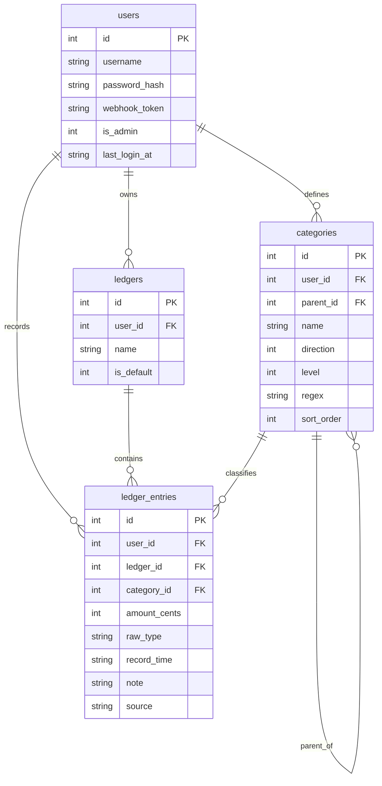

# Almanac Ledger 数据模型设计文档 v3.0

> 上游依据：`docs/ledger_requirements.md` (v1.14)、`docs/ledger_interaction_design.md` (v1.4)
> 本文从交互设计反推数据实体，定义表结构、约束、索引、触发器与关系。所有关键决策已落定（见第 6 节）。

## 1. 设计原则

- **交互驱动**：实体字段来自各页面/链路的读写诉求，非凭空建模。
- **多用户隔离**：所有业务表携带 `user_id`，查询强制按用户过滤。
- **金额精度与方向**：金额以「整数分」**无符号绝对值**存储（`INTEGER`，恒为正），¥19.90 存为 `1990`。**收支方向不再由金额符号承载**，而由账目归属分类的 `direction` 派生（方案 B）。账目表仍不设独立 direction 字段：已归类账目的方向 = `category.direction`；未归类（`category_id IS NULL`，待分类）账目**暂无方向**，不计入收/支汇总，直到用户手动指定分类。
- **元→分转换**：所有输入来源（webhook / manual / csv）金额均为元（小数）。入库前统一由**应用层（Go）使用 decimal 库或字符串移位解析**处理为整数分，**避免 `float64 * 100` 的 IEEE 754 精度截断**（如 19.90 可能变 1989.9999... 导致 round 边界错误）。应用层前置拦截 `amount == 0`。
- **金额入参禁用 float64 接收**（源头防脏）：Go 接收 Webhook JSON 时，若用 `float64` 字段接 `amount`，`json.Unmarshal` 在进入 decimal 库**之前**就已发生 IEEE 754 精度丢失（`-19.9` → `-19.8999...`），事后 `decimal.NewFromFloat()` 无法回天。**硬约束**：必须用 `json.Number`（`Decoder.UseNumber()`）解析，或强约定客户端传字符串 `"-19.9"`，再交 decimal 库处理；严禁用 `float64` 接入参。
- **树结构**：分类采用邻接表（`parent_id` 自引用），配合 SQLite 递归 CTE 做多级汇总。层级 ≤ 5。
- **叶子实时派生**：不存 `is_leaf` 字段。是否叶子由「有无子节点」实时判定（`NOT EXISTS` 子查询），从结构上消除状态同步问题，并天然实现"非叶子节点路由自动失效"。
- **正则包含匹配**：分类的 `regex` 存**裸关键词**（如 `瑞幸`），依托 Go `regexp.MatchString` 的非锚定特性天然实现包含匹配；精确匹配由用户在高级模式手写 `^...$`。
- **时间格式**：账目时间入库为定长 ISO 文本 `YYYY-MM-DD HH:mm`（东八区墙钟，字典序=时间序）。Webhook 传入带时区偏移的 ISO 8601，后端归一化到东八区后存储。
- **外键强制**：每个 DB 连接必须执行 `PRAGMA foreign_keys = ON`（SQLite 默认关闭），否则所有外键与级联失效。

## 2. 实体关系概览



> 注：ER 图省略各表 `created_at`/`updated_at` 审计字段。

## 3. 表结构详设

### 3.1 `users`（用户表）
| 字段 | 类型 | 约束 | 说明 |
| :--- | :--- | :--- | :--- |
| `id` | INTEGER | PK AUTOINCREMENT | |
| `username` | TEXT | UNIQUE NOT NULL | 登录用户名 |
| `password_hash` | TEXT | NOT NULL | 密码哈希（bcrypt/argon2） |
| `webhook_token` | TEXT | UNIQUE NOT NULL | Webhook 鉴权令牌，可重置 |
| `is_admin` | INTEGER | NOT NULL DEFAULT 0 | 管理员标志：1=管理员（可增删改其他账户）/ 0=普通用户。首启播种的 admin 为 1，其余为 0 |
| `created_at` | TEXT | NOT NULL | 创建时间 |
| `updated_at` | TEXT | NOT NULL | 最后修改时间 |
| `last_login_at` | TEXT | NULL | 上次登录时间（RFC3339，登录成功回写）；NULL=自该功能上线后从未登录 |

- 索引：`username`、`webhook_token` 均唯一索引。

### 3.2 `ledgers`（账本表，预留多账本）
| 字段 | 类型 | 约束 | 说明 |
| :--- | :--- | :--- | :--- |
| `id` | INTEGER | PK AUTOINCREMENT | |
| `user_id` | INTEGER | NOT NULL FK→users.id ON DELETE CASCADE | 所属用户 |
| `name` | TEXT | NOT NULL DEFAULT '默认账本' | 账本名 |
| `is_default` | INTEGER | NOT NULL DEFAULT 1 | 是否默认账本 |
| `created_at` | TEXT | NOT NULL | |
| `updated_at` | TEXT | NOT NULL | |

- 第一阶段每用户自动创建 1 个默认账本。该表为**前瞻预留**（决策点 A），使未来升级单用户多账本时无需改表结构。
- **默认账本唯一性（DB 层兵底）**：关系型库无法用普通约束限制“每用户最多一行 `is_default=1`”。多账本阶段若应用层 Bug（并发创建/事务回滚不全/误手 UPDATE）可能出现两个默认账本，导致 Webhook 入账 `SELECT ... WHERE is_default=1` 拿到多行而崩溃。用**局部唯一索引**在 DB 层强制每用户最多一个默认账本（SQLite 3.8+ 支持，仅对 `is_default=1` 的行建索引，零额外开销）：
```sql
CREATE UNIQUE INDEX idx_user_default_ledger ON ledgers(user_id) WHERE is_default = 1;
```

### 3.3 `categories`（分类树表）
| 字段 | 类型 | 约束 | 说明 |
| :--- | :--- | :--- | :--- |
| `id` | INTEGER | PK AUTOINCREMENT | |
| `user_id` | INTEGER | NOT NULL FK→users.id ON DELETE CASCADE | 所属用户 |
| `parent_id` | INTEGER | FK→categories.id **ON DELETE RESTRICT** NULL | 父分类，根节点为 NULL |
| `name` | TEXT | NOT NULL | 分类名称 |
| `direction` | INTEGER | NOT NULL CHECK(direction IN (-1, 1)) | 1:收入 / -1:支出 |
| `level` | INTEGER | NOT NULL CHECK(level BETWEEN 1 AND 5) | 层级 1~5 |
| `regex` | TEXT | NULL | 匹配裸关键词（包含匹配）；任意层级节点均可配 |
| `sort_order` | INTEGER | NOT NULL DEFAULT 0 | 同层拖拽序 = 展示序 = 同层匹配先后 |
| `created_at` | TEXT | NOT NULL | |
| `updated_at` | TEXT | NOT NULL | |

- **叶子实时派生**：不存 `is_leaf`。叶子 = 无子节点（`NOT EXISTS`），仅用于展示。路由全员参与，不区分叶子。
- **域界（Scope）= 用户级共享**（决策点 N）：`categories` 只挂 `user_id`，**不挂 `ledger_id`**。一个用户的全部账本共用同一棵分类树。即使将来升级多账本，分类体系仍为用户级共享，不随账本分裂。→ **切勿给 `categories` 加 `ledger_id`**（否则与本决策矛盾）。因此改分类名称/方向会波及该用户所有账本的历史归类，交互层需慎重。
- **方向继承（DB 级不变式）**：由触发器强制校验子节点 `direction = 父.direction`（见 3.5），违反则 ABORT。属系统级致命不变式，测试最高优先级。
- **删除策略**：`parent_id` 为 `ON DELETE RESTRICT`——禁止删除带子节点的父类，强制用户自下而上清理。
- 索引：`(user_id, parent_id)`（树遍历 + 叶子判定）；`(user_id, sort_order)`（路由/展示排序）。

### 3.4 `ledger_entries`（账目流水表）
| 字段 | 类型 | 约束 | 说明 |
| :--- | :--- | :--- | :--- |
| `id` | INTEGER | PK AUTOINCREMENT | |
| `user_id` | INTEGER | NOT NULL FK→users.id ON DELETE CASCADE | 所属用户 |
| `ledger_id` | INTEGER | NOT NULL FK→ledgers.id ON DELETE CASCADE | 入库时解析为该用户默认账本 id |
| `category_id` | INTEGER | FK→categories.id **ON DELETE SET NULL** NULL | 归类节点（任意层级）；NULL=待分类 |
| `amount_cents` | INTEGER | NOT NULL CHECK(amount_cents > 0) | 金额**无符号绝对值**，单位：分。恒为正。方向由归类分类派生，与此字段无关。由输入元值经应用层 `round(abs(amount)*100)` 得到。 |
| `raw_type` | TEXT | NOT NULL | 原始描述（Webhook 的 `type`） |
| `record_time` | TEXT | NOT NULL | 记账时间（`YYYY-MM-DD HH:mm` 定长 ISO，东八区墙钟） |
| `note` | TEXT | NULL | 备注（手动记账/补充用） |
| `source` | TEXT | NOT NULL DEFAULT 'webhook' CHECK(source IN ('webhook','manual','csv')) | 来源 |
| `created_at` | TEXT | NOT NULL | 入库时间 |
| `updated_at` | TEXT | NOT NULL | 最后修改时间 |

- **字段映射**（Webhook → 入库）：`date → record_time`（带时区 ISO 8601 归一化为东八区墙钟）；`type → raw_type`；`amount → amount_cents`（元→分，取绝对值）。
- **待分类表达**：`category_id IS NULL` 即待分类（隐式，不加 status 字段）。**（决策点 D）**
- **方向判定**：方向 = 归类分类的 `direction`（需 `JOIN categories`）。支出 = `SUM WHERE c.direction=-1`、收入 = `SUM WHERE c.direction=1`；待分类（`category_id IS NULL`）既无方向也不计入任何一侧汇总。
- **删除策略**：`category_id` 为 `ON DELETE SET NULL`——删分类时历史账目自动退回“待分类”，不丢账不报错。
- **归类校验**：任意分类都可贴到任意账目上（金额无符号，不再校验方向与符号一致）；贴上后账目方向即该分类的方向。
- **幂等去重**：**不加全量 UNIQUE 约束**（允许同分钟同额合法重复）。去重仅在 CSV 导入链路的**应用层导入事务内**处理：逐行以（`record_time` + `raw_type` + `amount_cents`）为键与**库中已有记录**比对，命中则跳过（防止重复上传同一 CSV），与交互设计 §6.2 查重键一致。**注：去重比对锤点必须锁定“批次开始前的存量数据”**（如 `created_at < :batch_start` 或等价批次标记），**不得“边插边比”**——否则依据事务自身可见性，CSV 文件内的合法重复行（真在同分钟两笔同额消费）会被误拦。**（决策点 F）**
- 索引：`(user_id, record_time)`（时光轴/月份筛选）；`(user_id, category_id)`（分类汇总与待分类快查）。

### 3.5 触发器：方向继承强校验 + 多租户隔离
```sql
-- 插入时：若有父，强制 direction 与父一致，且父必须属同一用户
CREATE TRIGGER trg_cat_dir_ins BEFORE INSERT ON categories
WHEN NEW.parent_id IS NOT NULL
BEGIN
    SELECT CASE
        WHEN (SELECT user_id FROM categories WHERE id = NEW.parent_id) <> NEW.user_id
            THEN RAISE(ABORT, 'parent category must belong to the same user')
        WHEN (SELECT direction FROM categories WHERE id = NEW.parent_id) <> NEW.direction
            THEN RAISE(ABORT, 'direction must inherit from parent')
    END;
END;

-- 更新时：同理
CREATE TRIGGER trg_cat_dir_upd BEFORE UPDATE ON categories
WHEN NEW.parent_id IS NOT NULL
BEGIN
    SELECT CASE
        WHEN (SELECT user_id FROM categories WHERE id = NEW.parent_id) <> NEW.user_id
            THEN RAISE(ABORT, 'parent category must belong to the same user')
        WHEN (SELECT direction FROM categories WHERE id = NEW.parent_id) <> NEW.direction
            THEN RAISE(ABORT, 'direction must inherit from parent')
    END;
END;
```
> 两条不变式一同下沉到 DB 层：**方向继承**防收支语义错乱；**同用户校验**堵住跨租户“嫁接”（恶意/Bug 把 A 的节点 parent_id 指向 B 的分类）导致的越权与报表错乱。即使应用层 Bug 或直连库修改也无法破坏。

### 3.6 触发器：direction 不可变
分类方向一旦创建不得修改（否则会连带子树与历史账目的收支语义错乱）。
```sql
CREATE TRIGGER trg_cat_dir_immutable BEFORE UPDATE OF direction ON categories
WHEN OLD.direction <> NEW.direction
BEGIN
    SELECT RAISE(ABORT, 'direction is immutable');
END;
```
> 要改方向只能删除重建分类。配合 3.5 的继承校验，方向形成“创建即冻结 + 严格继承”的双重保障。

<!-- PLACEHOLDER -->

## 4. 关键查询范式

### 4.1 多级报表汇总（递归 CTE）
```sql
WITH RECURSIVE subtree(id) AS (
    SELECT id FROM categories WHERE id = :category_id AND user_id = :uid
    UNION ALL
    SELECT c.id FROM categories c
    JOIN subtree s ON c.parent_id = s.id
)
SELECT COALESCE(SUM(e.amount_cents), 0) AS total_cents
FROM ledger_entries e
WHERE e.user_id = :uid
  AND e.ledger_id = :ledger_id
  AND e.category_id IN (SELECT id FROM subtree);
```
> 若只看“本级直接”（不含子孙）：`WHERE category_id = :category_id`。下钻时用“本级直接”伪切片 = 本节点子树总额 − 各子节点子树总额之和。因方向从根节点继承（同一子树方向一致），`SUM(amount_cents)` 直接为该方向的汇总金额（无符号），无需再乘符号。

### 4.2 路由引擎拉取规则（全员节点跨方向，深度优先）
```sql
SELECT c.id, c.regex, c.name, c.direction, c.level, c.sort_order FROM categories c
WHERE c.user_id = :uid
ORDER BY c.level DESC, c.sort_order ASC, c.id ASC;  -- 深度优先，同层拖拽序，跨子树 id 兑底
```
由于方向不再由 `amount` 符号预先锁定，路由引擎拉取该用户**全部分类（收/支合并）**，用 Go `regexp` 预编译并缓存（裸关键词自然成包含匹配；未配正则的分类默认生成 `^转义分类名$` 精确全等），按上述顺序依次匹配 `raw_type`，命中即止。**命中分类的 `direction` 即为该账目的收支方向**。若无任何分类命中，账目存为待分类（`category_id IS NULL`）。

### 4.3 月度收支统计
```sql
-- 本月支出（方向由分类派生，金额恒为正）
SELECT COALESCE(SUM(e.amount_cents), 0) AS expense_cents
FROM ledger_entries e JOIN categories c ON c.id = e.category_id
WHERE e.user_id = :uid AND e.ledger_id = :ledger_id
  AND substr(e.record_time, 1, 7) = :month AND c.direction = -1;

-- 本月收入
SELECT COALESCE(SUM(e.amount_cents), 0) AS income_cents
FROM ledger_entries e JOIN categories c ON c.id = e.category_id
WHERE e.user_id = :uid AND e.ledger_id = :ledger_id
  AND substr(e.record_time, 1, 7) = :month AND c.direction = 1;

-- 结余（净值 = 收入 - 支出）
SELECT COALESCE(SUM(e.amount_cents * c.direction), 0) AS balance_cents
FROM ledger_entries e JOIN categories c ON c.id = e.category_id
WHERE e.user_id = :uid AND e.ledger_id = :ledger_id
  AND substr(e.record_time, 1, 7) = :month;
```
> `record_time` 为定长 ISO 文本，`substr(...,1,7)` 取 `YYYY-MM` 按月分组。注意三条统计均用 **`JOIN categories`**（非 LEFT JOIN），因此待分类账目（`category_id IS NULL`）自然被排除，既不计收也不计支；方向全靠 `c.direction`，金额恒为正。待分类总额单独查：`WHERE category_id IS NULL`。

## 5. 应用层强保障的不变式（DB 兼不住的部分）
- **层级 ≤ 5**：新建/移动子树时在事务内重算并校验 `level`。
- **`category_id` 可指任意节点**（方案 3）：不再强制叶子。下钻展示时前端需渲染“本级直接”伪切片以保证子项之和 = 父级总额。
- **金额无符号（绝对值）入库**、**拒绝 `amount == 0`**、**元→分四舍五入**。方向不再与金额符号绑定，而由归类分类派生；任意方向的分类都可贴到任意账目上，无需方向校验。
- **时区归一化**：解析带偏移 ISO 8601（如 `2026-07-05T14:30:00+08:00`）→ 东八区墙钟时间 `YYYY-MM-DD HH:mm`。**秒级精度直接截断（truncate）**，不四舍五入（避免 `14:30:45` 变 `14:31` 的诡异跳变）。

## 6. 决策点落定
| 编号 | 决策点 | 最终决策 |
| :--- | :--- | :--- |
| A | 引入 `ledgers` 表 | ✅ 引入（预留） |
| B | 金额存整数分 | ✅ 整数分（**无符号绝对值**， v2.9 由带符号改为无符号） |
| C | 树存储邻接表 | ✅ 邻接表 + 递归 CTE |
| D | 待分类隐式 NULL | ✅ 隐式 NULL |
| E | `record_time` 存文本 | ✅ 定长 ISO 文本 |
| F | 幂等去重方式 | ✅ 无全量 UNIQUE，去重收拢到 CSV 导入事务层 |
| G | 方向来源（账目） | ✅ 账目表不设 direction 字段；**方向由归类分类 `direction` 派生**（v2.9，原“符号即方向”废弃）；待分类无方向 |
| H | `is_leaf` 字段 | ✅ 移除，仅展示时 `NOT EXISTS` 实时派生 |
| I | 正则匹配语义与范围 | ✅ 全员节点可配；包含匹配（裸词）；深度优先 + 同层 sort_order |
| M | 账目归属层级 | ✅ 可归任意节点（方案 3）；`priority` 字段并入 `sort_order` |
| J | 外键级联 | ✅ parent RESTRICT / leaf SET NULL / user CASCADE；`PRAGMA foreign_keys=ON` |
| K | 方向继承校验 | ✅ 触发器 DB 级强校验 |
| L | 时区处理 | ✅ 带偏移 ISO 8601 入参，后端归一化东八区（舍秒 truncate） |
| N | 分类树域界（Scope） | ✅ 用户级共享；`categories` 不挂 `ledger_id`，全账本共用一棵树 |

---
**版本说明**：
- v2.0 (2026-07-05)：大修。移除 `is_leaf`（实时派生）；正则改包含匹配存裸词；补外键级联（RESTRICT/SET NULL/CASCADE + PRAGMA）；方向继承触发器；`direction`/`source` CHECK；各表加 `updated_at`；字段映射说明；幂等去重收拢到导入事务层；时区强契约。
- v2.1 (2026-07-05)：补 direction 不可变触发器；ER 图补 note/source；元→分转换改用 decimal 库避免浮点截断。
- v2.2 (2026-07-05)：采纳方案 3（账目可挂任意节点）；`leaf_category_id → category_id`；正则全员可配、深度优先 + 同层 `sort_order` 拖拽（合并 `priority`）；路由查询去 `NOT EXISTS`；下钻需“本级直接”伪切片。
- v2.3 (2026-07-05)：明确 CSV 去重语义为“与库中已有记录比对（record_time+raw_type+amount_cents）”，与交互 §6.2“防止重复导入”对齐，消除“仅批次内去重”歧义。
- v2.4 (2026-07-05)：补两道防线——金额入参严禁 float64 接收（强制 json.Number 或字符串，源头防 IEEE 754 截断）；3.5 触发器增加多租户隔离校验（父节点必须属同一用户，堵跨租户嫁接越权）。
- v2.5 (2026-07-05)：修路由与多账本一致性——4.2 路由拉取补 `direction` 过滤（先按 amount 符号定方向，不跨方向试匹）；4.1/4.3 查询补 `ledger_id` 过滤（前瞻多账本）；第 5 节时区归一化明确“主动舍秒 truncate”。
- v2.6 (2026-07-05)：定栁分类树域界为**用户级共享**（决策点 N）：`categories` 不挂 `ledger_id`，全账本共用一棵分类树；3.3 补域界说明，消除多账本归属盲区。
- v2.7 (2026-07-05)：三道 DB 层加固——`amount_cents` 补 `CHECK(!= 0)`（零金额堆不进库，与原则对齐）；`ledgers` 补局部唯一索引 `idx_user_default_ledger`（每用户最多一个默认账本）；3.4 去重说明补“批次锤点”机制（不得边插边比，否则误拦文件内合法重复）。
- v2.8 (2026-07-05)：`users` 表补 `is_admin`（INTEGER NOT NULL DEFAULT 0），支撑账户管理（仅管理员可增删改其他账户）；首启播种 admin 为 1，`/api/users` 新建账户为 0；ER 图同步。迁移采用 `ALTER TABLE ... ADD COLUMN` + `UPDATE ... WHERE username='admin'` 回填存量。
- v2.9 (2026-07-06)：**方案 B 重构——方向由分类派生、金额改存无符号绝对值**。追上游需求 v1.14：第 1 节金额精度与方向改为“无符号 + 方向来自分类”；3.4 `amount_cents` 约束 `!= 0` → `> 0`，方向判定/归类校验/字段映射同步（取绝对值、不再校验符号）；4.2 路由拉取去掉 `direction = :direction` 过滤（收/支合并跨方向匹配）；4.3 月度统计改为 `JOIN categories` 按 `c.direction` 分收支（待分类自然排除）；第 5 节不变式“符号与方向一致”→“无符号入库、无需方向校验”；决策点 B/G 更新。**需配套数据迁移**：存量 `amount_cents` 取绝对值（`UPDATE ... SET amount_cents = abs(amount_cents)`），旧符号与新分类方向已天然一致（负数原本就归在支出类）。
- v3.0 (2026-07-07)：`users` 表补 `last_login_at`（TEXT NULL），记录用户上次登录时间，支撑账户管理页展示成员活跃状态；登录成功后由后端 best-effort 回写（RFC3339，写失败不阻塞登录）；`/api/users`（`ListUsers`）用 `COALESCE(last_login_at,'')` 返回该字段（空串=从未登录）；ER 图同步。迁移采用幂等 `ALTER TABLE users ADD COLUMN last_login_at TEXT`（`migrateLastLogin`），老库存量用户该字段为 NULL，展示为“从未登录”。
