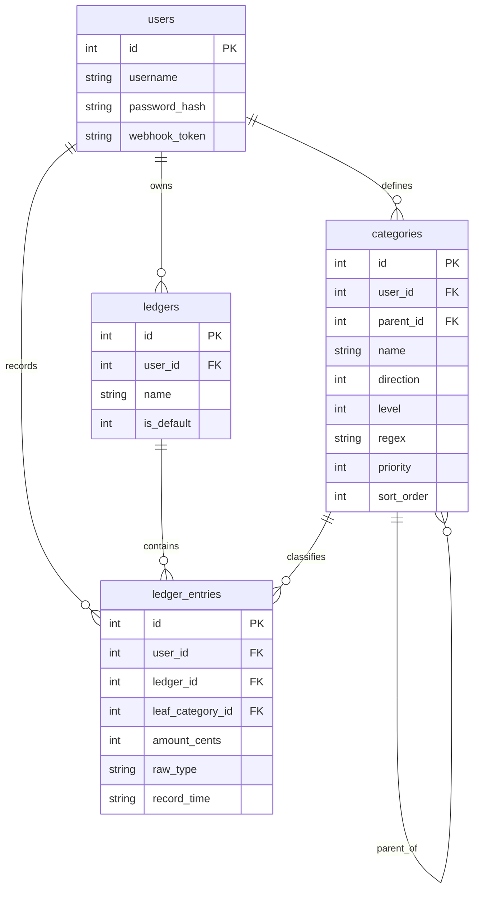

# Almanac Ledger 数据模型设计文档 v2.0

> 上游依据：`docs/ledger_requirements.md` (v1.6)、`docs/ledger_interaction_design.md` (v1.1)
> 本文从交互设计反推数据实体，定义表结构、约束、索引、触发器与关系。所有关键决策已落定（见第 6 节）。

## 1. 设计原则

- **交互驱动**：实体字段来自各页面/链路的读写诉求，非凭空建模。
- **多用户隔离**：所有业务表携带 `user_id`，查询强制按用户过滤。
- **金额精度与方向**：金额以「整数分」**带符号**存储（`INTEGER`）。支出为负、收入为正，¥19.90 支出存为 `-1990`。方向即符号，账目表不设 direction 字段。
- **元→分转换**：所有输入来源（webhook / manual / csv）金额均为元（小数），入库前统一由**应用层（Go）四舍五入到分**（`round(amount * 100)`）。应用层前置拦截 `amount == 0`。
- **树结构**：分类采用邻接表（`parent_id` 自引用），配合 SQLite 递归 CTE 做多级汇总。层级 ≤ 5。
- **叶子实时派生**：不存 `is_leaf` 字段。是否叶子由「有无子节点」实时判定（`NOT EXISTS` 子查询），从结构上消除状态同步问题，并天然实现"非叶子节点路由自动失效"。
- **正则包含匹配**：分类的 `regex` 存**裸关键词**（如 `瑞幸`），依托 Go `regexp.MatchString` 的非锚定特性天然实现包含匹配；精确匹配由用户在高级模式手写 `^...$`。
- **时间格式**：账目时间入库为定长 ISO 文本 `YYYY-MM-DD HH:mm`（东八区墙钟，字典序=时间序）。Webhook 传入带时区偏移的 ISO 8601，后端归一化到东八区后存储。
- **外键强制**：每个 DB 连接必须执行 `PRAGMA foreign_keys = ON`（SQLite 默认关闭），否则所有外键与级联失效。

## 2. 实体关系概览



> 注：`is_leaf` 不作为物理字段存在（实时派生）；ER 图省略各表 `created_at`/`updated_at` 审计字段。

## 3. 表结构详设

### 3.1 `users`（用户表）
| 字段 | 类型 | 约束 | 说明 |
| :--- | :--- | :--- | :--- |
| `id` | INTEGER | PK AUTOINCREMENT | |
| `username` | TEXT | UNIQUE NOT NULL | 登录用户名 |
| `password_hash` | TEXT | NOT NULL | 密码哈希（bcrypt/argon2） |
| `webhook_token` | TEXT | UNIQUE NOT NULL | Webhook 鉴权令牌，可重置 |
| `created_at` | TEXT | NOT NULL | 创建时间 |
| `updated_at` | TEXT | NOT NULL | 最后修改时间 |

- 索引：`username`、`webhook_token` 均唯一索引。

### 3.2 `ledgers`（账本表，预留多账本）
| 字段 | 类型 | 约束 | 说明 |
| :--- | :--- | :--- | :--- |
| `id` | INTEGER | PK AUTOINCREMENT | |
| `user_id` | INTEGER | NOT NULL FK→users.id ON DELETE CASCADE | 所属用户 |
| `name` | TEXT | NOT NULL DEFAULT '默认账本' | 账本名 |
| `is_default` | INTEGER | NOT NULL DEFAULT 1 | 是否默认账本 |
| `created_at` | TEXT | NOT NULL | |
| `updated_at` | TEXT | NOT NULL | |

- 第一阶段每用户自动创建 1 个默认账本。该表为**前瞻预留**（决策点 A），使未来升级单用户多账本时无需改表结构。

### 3.3 `categories`（分类树表）
| 字段 | 类型 | 约束 | 说明 |
| :--- | :--- | :--- | :--- |
| `id` | INTEGER | PK AUTOINCREMENT | |
| `user_id` | INTEGER | NOT NULL FK→users.id ON DELETE CASCADE | 所属用户 |
| `parent_id` | INTEGER | FK→categories.id **ON DELETE RESTRICT** NULL | 父分类，根节点为 NULL |
| `name` | TEXT | NOT NULL | 分类名称 |
| `direction` | INTEGER | NOT NULL CHECK(direction IN (-1, 1)) | 1:收入 / -1:支出 |
| `level` | INTEGER | NOT NULL CHECK(level BETWEEN 1 AND 5) | 层级 1~5 |
| `regex` | TEXT | NULL | 匹配裸关键词（包含匹配）；仅对叶子节点生效 |
| `priority` | INTEGER | NOT NULL DEFAULT 0 | 匹配优先级，越大越先 |
| `sort_order` | INTEGER | NOT NULL DEFAULT 0 | 同级展示排序 |
| `created_at` | TEXT | NOT NULL | |
| `updated_at` | TEXT | NOT NULL | |

- **叶子实时派生**：不存 `is_leaf`。叶子 = 无子节点（`NOT EXISTS (SELECT 1 FROM categories c WHERE c.parent_id = x.id)`）。节点一旦挂子节点，其 `regex` 自动失效（不再被路由查询命中）；删光子节点后自动恢复。
- **方向继承（DB 级不变式）**：由触发器强制校验子节点 `direction = 父.direction`（见 3.5），违反则 ABORT。属系统级致命不变式，测试最高优先级。
- **删除策略**：`parent_id` 为 `ON DELETE RESTRICT`——禁止删除带子节点的父类，强制用户自下而上清理。
- 索引：`(user_id, parent_id)`（树遍历 + 叶子判定）；`(user_id, priority)`（路由排序）。

### 3.4 `ledger_entries`（账目流水表）
| 字段 | 类型 | 约束 | 说明 |
| :--- | :--- | :--- | :--- |
| `id` | INTEGER | PK AUTOINCREMENT | |
| `user_id` | INTEGER | NOT NULL FK→users.id ON DELETE CASCADE | 所属用户 |
| `ledger_id` | INTEGER | NOT NULL FK→ledgers.id ON DELETE CASCADE | 入库时解析为该用户默认账本 id |
| `leaf_category_id` | INTEGER | FK→categories.id **ON DELETE SET NULL** NULL | 归类叶子；NULL=待分类 |
| `amount_cents` | INTEGER | NOT NULL | 金额**带符号**，单位：分。支出负/收入正。由输入元值经应用层 `round(amount*100)` 得到。 |
| `raw_type` | TEXT | NOT NULL | 原始描述（Webhook 的 `type`） |
| `record_time` | TEXT | NOT NULL | 记账时间（`YYYY-MM-DD HH:mm` 定长 ISO，东八区墙钟） |
| `note` | TEXT | NULL | 备注（手动记账/补充用） |
| `source` | TEXT | NOT NULL DEFAULT 'webhook' CHECK(source IN ('webhook','manual','csv')) | 来源 |
| `created_at` | TEXT | NOT NULL | 入库时间 |
| `updated_at` | TEXT | NOT NULL | 最后修改时间 |

- **字段映射**（Webhook → 入库）：`date → record_time`（带时区 ISO 8601 归一化为东八区墙钟）；`type → raw_type`；`amount → amount_cents`（元→分）。
- **待分类表达**：`leaf_category_id IS NULL` 即待分类（隐式，不加 status 字段）。**（决策点 D）**
- **方向判定**：`amount_cents` 符号即方向。支出=`SUM WHERE <0`、收入=`SUM WHERE >0`；待分类仍能靠符号统计。
- **删除策略**：`leaf_category_id` 为 `ON DELETE SET NULL`——删叶子分类时，历史账目自动退回“待分类”，不丢账不报错。
- **归类校验**：应用层校验金额符号与叶子分类 `direction` 一致。
- **幂等去重**：**不加全量 UNIQUE 约束**（允许同分钟同额合法重复）。去重仅在 CSV 导入链路的**应用层导入事务内**处理（基于文件内容/批次计算）。**（决策点 F）**
- 索引：`(user_id, record_time)`（时光轴/月份筛选）；`(user_id, leaf_category_id)`（分类汇总与待分类快查）。

### 3.5 触发器：方向继承强校验
```sql
-- 插入时：若有父，强制 direction 与父一致
CREATE TRIGGER trg_cat_dir_ins BEFORE INSERT ON categories
WHEN NEW.parent_id IS NOT NULL
BEGIN
    SELECT CASE WHEN (SELECT direction FROM categories WHERE id = NEW.parent_id) <> NEW.direction
        THEN RAISE(ABORT, 'direction must inherit from parent') END;
END;

-- 更新时：同理
CREATE TRIGGER trg_cat_dir_upd BEFORE UPDATE ON categories
WHEN NEW.parent_id IS NOT NULL
BEGIN
    SELECT CASE WHEN (SELECT direction FROM categories WHERE id = NEW.parent_id) <> NEW.direction
        THEN RAISE(ABORT, 'direction must inherit from parent') END;
END;
```
> 该不变式下沉到 DB 层，即使应用层 Bug 或直连库修改也无法破坏。

## 4. 关键查询范式

### 4.1 多级报表汇总（递归 CTE）
```sql
WITH RECURSIVE subtree(id) AS (
    SELECT id FROM categories WHERE id = :category_id AND user_id = :uid
    UNION ALL
    SELECT c.id FROM categories c
    JOIN subtree s ON c.parent_id = s.id
)
SELECT COALESCE(SUM(e.amount_cents), 0) AS total_cents
FROM ledger_entries e
WHERE e.user_id = :uid
  AND e.leaf_category_id IN (SELECT id FROM subtree);
```

### 4.2 路由引擎拉取叶子规则（实时派生叶子）
```sql
SELECT c.id, c.regex, c.priority FROM categories c
WHERE c.user_id = :uid
  AND c.regex IS NOT NULL
  AND NOT EXISTS (SELECT 1 FROM categories ch WHERE ch.parent_id = c.id)  -- 仅叶子
ORDER BY c.priority DESC, c.id ASC;
```
应用层用 Go `regexp` 预编译并缓存正则（裸关键词自然成包含匹配），依次匹配 `raw_type`，命中即止。

### 4.3 月度收支统计
```sql
-- 本月支出（取绝对值）
SELECT -COALESCE(SUM(amount_cents), 0) AS expense_cents
FROM ledger_entries
WHERE user_id = :uid AND substr(record_time, 1, 7) = :month AND amount_cents < 0;

-- 本月收入
SELECT COALESCE(SUM(amount_cents), 0) AS income_cents
FROM ledger_entries
WHERE user_id = :uid AND substr(record_time, 1, 7) = :month AND amount_cents > 0;

-- 结余（净值）
SELECT COALESCE(SUM(amount_cents), 0) AS balance_cents
FROM ledger_entries
WHERE user_id = :uid AND substr(record_time, 1, 7) = :month;
```
> `record_time` 为定长 ISO 文本，`substr(...,1,7)` 取 `YYYY-MM` 按月分组。

## 5. 应用层强保障的不变式（DB 兼不住的部分）
- **层级 ≤ 5**：新建/移动子树时在事务内重算并校验 `level`。
- **`leaf_category_id` 必指向叶子**：归类时应用层确保目标无子节点。
- **金额符号与分类方向一致**、**拒绝 `amount == 0`**、**元→分四舍五入**。
- **时区归一化**：解析带偏移 ISO 8601 → 东八区墙钟。

## 6. 决策点落定
| 编号 | 决策点 | 最终决策 |
| :--- | :--- | :--- |
| A | 引入 `ledgers` 表 | ✅ 引入（预留） |
| B | 金额存整数分 | ✅ 整数分（带符号） |
| C | 树存储邻接表 | ✅ 邻接表 + 递归 CTE |
| D | 待分类隐式 NULL | ✅ 隐式 NULL |
| E | `record_time` 存文本 | ✅ 定长 ISO 文本 |
| F | 幂等去重方式 | ✅ 无全量 UNIQUE，去重收拢到 CSV 导入事务层 |
| G | `direction` 字段（账目） | ✅ 移除，符号即方向 |
| H | `is_leaf` 字段 | ✅ 移除，`NOT EXISTS` 实时派生 |
| I | 正则匹配语义 | ✅ 包含匹配（存裸词），精确匹配用户手写 `^$` |
| J | 外键级联 | ✅ parent RESTRICT / leaf SET NULL / user CASCADE；`PRAGMA foreign_keys=ON` |
| K | 方向继承校验 | ✅ 触发器 DB 级强校验 |
| L | 时区处理 | ✅ 带偏移 ISO 8601 入参，后端归一化东八区 |

---
**版本说明**：
- v2.0 (2026-07-05)：大修。移除 `is_leaf`（实时派生）；正则改包含匹配存裸词；补外键级联（RESTRICT/SET NULL/CASCADE + PRAGMA）；方向继承触发器；`direction`/`source` CHECK；各表加 `updated_at`；字段映射说明；幂等去重收拢到导入事务层；时区强契约。
