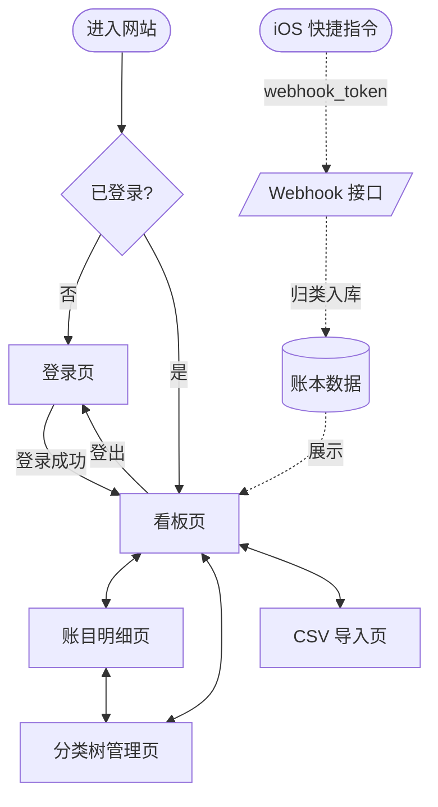
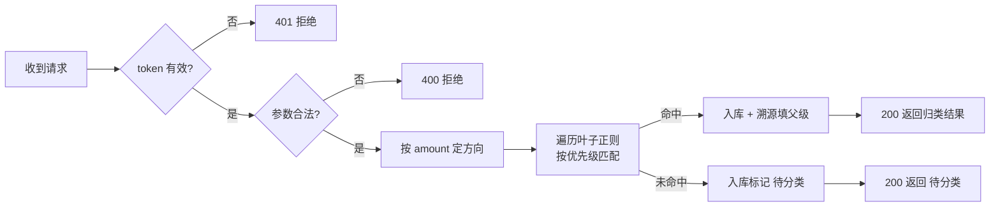
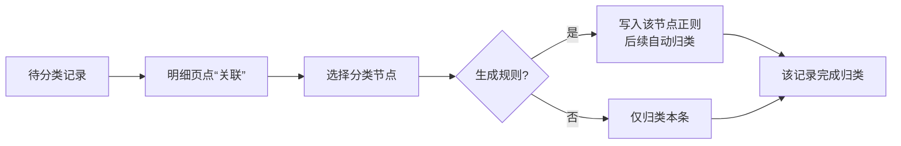
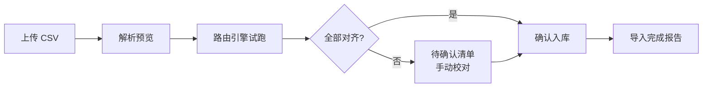

# Almanac Ledger 交互设计文档 v1.2

> 上游依据：`docs/ledger_requirements.md` (v1.7)
> 本文定义人机触点、页面布局与状态流转，作为后续数据建模与技术概要设计的输入。

## 0. 设计总览

### 0.1 访问模型
- **登录是硬门槛**：未登录无法看到任何账本数据、看板或入口。进站只呈现登录页。
- **登录即管理员**：任何用户登录后均拥有其账本内的完整权限（增删改查、分类维护、正则配置、CSV 导入），不做细粒度角色分级。
- **多用户数据隔离**：每个用户登录后仅能访问自己的账本，数据按 `user_id` 严格隔离。

### 0.2 三条核心链路
1. **记账链路（无人值守）**：iOS 快捷指令 → Webhook → 路由归类 → 入库。靠 `webhook_token` 鉴权，与登录态无关。
2. **登录闸门**：未登录一律拦截到登录页；登录成功进入管理应用。
3. **管理应用（登录后）**：看板页、账目明细页、分类树管理页、CSV 导入页。

### 0.3 全局导航流转


## 1. 记账链路（Webhook 无人值守）

### 1.1 触点说明
手机端快捷指令是唯一的“写入触点”，用户在此不与网页交互，只发一个 HTTP 请求。

### 1.2 请求 / 响应契约
- **请求**：`POST /api/webhook/entry`
  - 鉴权：Header 携带 `X-Webhook-Token: <token>`（每用户独立）。
  - Body (JSON)：
    ```json
    { "date": "2026-07-05T14:30:00+08:00", "type": "瑞幸咖啡", "amount": -19.9 }
    ```
  - 字段映射：`date → record_time`（带时区 ISO 8601，后端归一化为东八区墙钟）；`type → raw_type`；`amount → amount_cents`（元→分）。
- **响应三态**：
  | 场景 | HTTP | 返回体要点 | 手机端可提示 |
  | :--- | :--- | :--- | :--- |
  | 命中分类 | 200 | 归类结果（分类名 + 完整路径） | “已记入：餐饮/饮品/咖啡” |
  | 落入待分类 | 200 | `status: unclassified`（接口实时计算返回，非存储字段；库中以 `category_id IS NULL` 隐式表达） | “已记账，待补分类” |
  | 鉴权/参数错误 | 401/400 | 错误原因 | “记账失败：token 无效” |

### 1.3 状态流转


## 2. 登录闸门

### 2.1 线框：登录页
```
+--------------------------------------------------+
|                                                  |
|                Almanac 记账本                     |
|                                                  |
|        +----------------------------------+      |
|        |  用户名  [____________________]  |      |
|        |  密码    [____________________]  |      |
|        |            [   登  录   ]        |      |
|        +----------------------------------+      |
|                                                  |
|          未登录无法访问任何账本数据                |
+--------------------------------------------------+
```

### 2.2 交互反馈
- **用户操作**：输入用户名/密码 → 点「登录」。
- **系统反馈**：
  - 成功 → 建立会话（Session/JWT）→ 跳转看板页。
  - 失败 → 页内红字提示“用户名或密码错误”，不跳转。
- **会话保持**：已登录用户直接进站落到看板页，不再显示登录页。
- **登出**：应用内任意页可登出，清除会话回到登录页。

## 3. 看板页（登录后首页）

### 3.1 线框
```
+-----------------------------------------------------------+
| Almanac  [看板] [明细] [分类] [导入]        木云 ▾ [登出] |
+-----------------------------------------------------------+
| 时间范围: [ 2026-07 ▾ ]                                    |
|                                                           |
| +----------+  +----------+  +----------+                  |
| | 本月支出 |  | 本月收入 |  | 结    余 |                  |
| | ¥ 3,280 |  | ¥ 12,000|  | ¥ 8,720 |                  |
| +----------+  +----------+  +----------+                  |
|                                                           |
| +---------------------+   +---------------------------+   |
| |   支出分类饼图        |   |   收支趋势折线图          |   |
| |   (可点击下钻)        |   |                           |   |
| +---------------------+   +---------------------------+   |
|                                                           |
| ⚠ 发现 2 笔待分类记录  [去处理 >]                       |
+-----------------------------------------------------------+
```

### 3.2 交互反馈
- **月份切换**：顶部时间选择器切月 → 卡片与图表刷新。
- **饱图下钻**：点击一级分类扇区 → 展开其子孙分类占比（逐层下钻，最多 5 层）。金额按递归 CTE 汇总。因账目可直挂非叶节点，下钻时额外渲染一个“本级直接”伪切片（= 本节点总额 − 各子节点总额之和），保证子项之和 = 父级总额。
- **待分类入口**：高亮提示条，点“去处理”跳转账目明细页的待分类筛选。
- **看板在登录后为可配置编辑页**：可调整展示时间范围、图表类型（后续能力）。

## 4. 账目明细页

### 4.1 线框
```
+-----------------------------------------------------------+
| Almanac  [看板] [明细] [分类] [导入]        木云 ▾ [登出] |
+-----------------------------------------------------------+
| 筛选: [月份 ▾] [分类 ▾] [□ 仅看待分类]      [+ 手动记一笔]|
+-----------------------------------------------------------+
| 时间              原始描述     分类路径        金额       |
|-----------------------------------------------------------|
| 07-05 14:30     瑞幸咖啡     餐饮>饮品>咖啡    -19.90    |
| 07-05 09:00     工资         收入>薪资        +12000.00 |
| 07-04 20:15     智波扫码     ⚠ 待分类 [关联] -35.00    |
+-----------------------------------------------------------+
```

### 4.2 交互反馈
- **列表**：按 `record_time` 倒序（时光轴），支持按月份/分类筛选。
- **待分类行**：醒目标记，行内“关联”按钮 → 弹窗选择叶子分类。关联后可选“同时为该原始描述生成一条正则规则”，实现“一次设置、终身免录”。
- **手动记一笔**：补充录入入口（餐饮弹窗填日期/分类/金额/备注），应对非 Webhook 的临时记账。

## 5. 分类树管理页

### 5.1 线框
```
+-----------------------------------------------------------+
| Almanac  [看板] [明细] [分类] [导入]        木云 ▾ [登出] |
+-----------------------------------------------------------+
| [支出树] [收入树]                        [+ 新建一级分类] |
+---------------------------+-------------------------------+
| ▾ 餐饮 (支出)   ≡拖拽     |  右侧：选中节点详情           |
|   ▾ 饮品        ≡       |  名称: [咖啡__________]      |
|     • 咖嘜         ≡       |  方向: 支出 (继承自父，锁定)  |
|     • 奶茶         ≡       |  层级: 3 / 5                 |
|   ▸ 正餐        ≡       |  --------------------------- |
| ▸ 交通 (支出)   ≡       |  任意节点均可配以下区域：       |
|                           |  正则: [瑞幸____________]    |
|                           |  (同层拖拽排序定匹配先后)     |
|                           |  [普通模式] / [高级正则模式]    |
+---------------------------+-------------------------------+
```

### 5.2 交互反馈
- **树形维护**：增/删/改节点；拖拽调整层级与父子关系（受 5 层上限约束）。
- **方向继承（视觉约束）**：子节点方向锁定为父节点方向，不可修改（创建后也不可改）；跨方向拖拽被禁止。
- **全员可配规则**：**任意层级节点**右侧都出现“正则”编辑区（不再限叶子）。
- **匹配优先级**：按**层级深优先**（子 > 父自动成立）；同一父下的兵弟由用户**上下拖拽**定先后（每一层均可拖）；拖拽序同时也是展示序。
- **普通 vs 高级模式**：默认普通模式（输入裸关键词，底层存裸词如 `瑞幸`，依托 Go regexp 非锥定特性天然实现**包含匹配**）；切换高级模式可手编正则（如 `^瑞幸$` 做精确匹配）。

### 5.3 新物种发现回路


## 6. CSV 导入页

### 6.1 分步流程


### 6.2 交互反馈
- **上传**：选择飞书导出的 CSV；展示列映射预览（日期/类型/金额 列对应）。
- **试跑**：每行跑一遍路由引擎，展示归类结果。
- **待确认清单**：无法自动对齐的行单独列出，支持批量手动指定分类节点。
- **幂等去重**：基于（时间 + 原始描述 + 金额）查重，防止重复导入。
- **报告**：完成后展示成功/跳过/待分类条数统计。

## 7. 页面及状态清单（汇总）
| 页面 | 登录要求 | 核心交互 |
| :--- | :--- | :--- |
| 登录页 | 否 | 账号密码登录 |
| 看板页 | 是 | 月度汇总、饼图下钻、趋势 |
| 账目明细页 | 是 | 时光轴、筛选、待分类关联、手动记账 |
| 分类树管理页 | 是 | 树维护、正则/优先级配置 |
| CSV 导入页 | 是 | 上传→试跑→校对→入库 |
| Webhook 接口 | token 鉴权 | 机器写入，无 UI |

---
**版本说明**：
- v1.0 (2026-07-05)：首版交互设计，含三链路、五页面线框与状态流转。
- v1.1 (2026-07-05)：正则普通模式改为包含匹配（存裸词）；Webhook `date` 改为带时区 ISO 8601，并补充字段映射说明。
- v1.2 (2026-07-05)：采纳方案 3——账目可归任意层级节点；正则全员可配（删除叶子限制）；匹配优先级改为深度优先 + 同层拖拽排序；看板下钻补“本级直接”伪切片。
