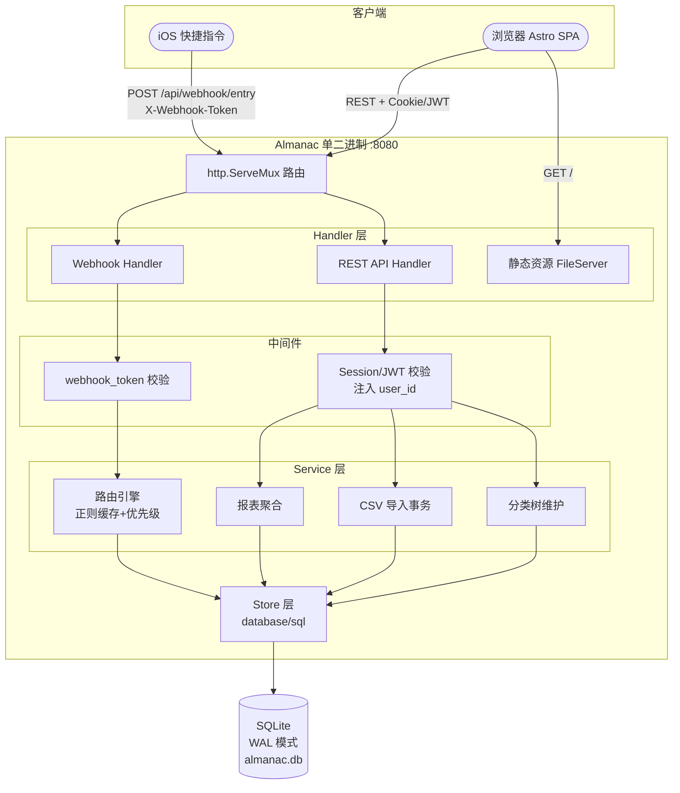
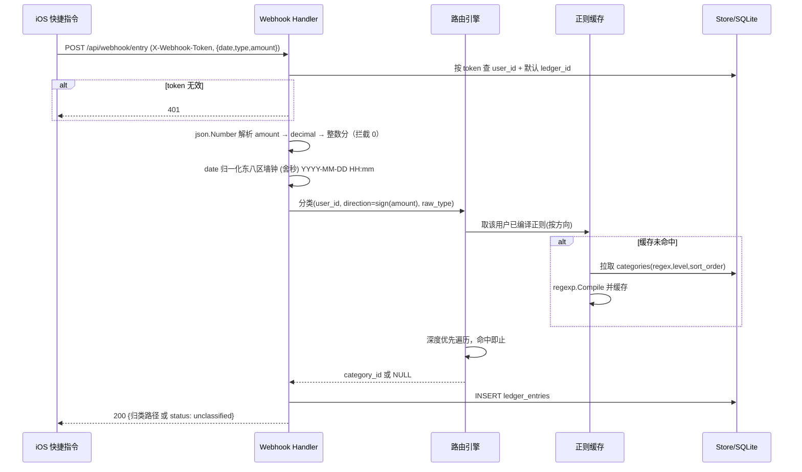
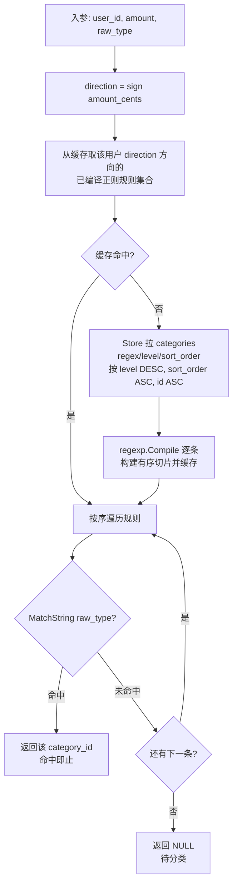

# Almanac Ledger 技术概要设计文档 v1.1

> 上游依据：`docs/ledger_requirements.md` (v1.12)、`docs/ledger_interaction_design.md` (v1.5)、`docs/ledger_data_model.md` (v2.7)
> 本文承接需求、交互与数据模型，定义系统的技术实现骨架：整体架构、关键查询、路由引擎、鉴权安全、API 端点与非功能落地。**不重复数据模型的表结构定义**（见数据模型文档），仅引用并补充实现细节。

## 1. 整体架构

### 1.1 技术栈与部署形态（沿用现状）
- **后端**：Go 单二进制。HTTP 用标准库 `net/http` + `http.ServeMux`。
- **数据库**：`modernc.org/sqlite`（纯 Go，无 CGO，交叉编译到 Windows 无痛）。
- **前端**：Astro build → `web/dist`，经 `embedfrontend` build tag 用 `//go:embed` 打进二进制（`cmd/almanac/embed_dist.go`），`http.FileServer` 挂在根路径 `/`。本地无前端时走 `embed_stub.go`，`go build/test/vet` 不受影响。
- **部署**：单可执行文件 + 一个 `almanac.db` 文件，NSSM 注册为 Windows 服务，监听 `:8080`。无外部依赖、无容器。

### 1.2 分层与目录（沿用 internal 骨架）
| 层 | 目录 | 职责 |
| :--- | :--- | :--- |
| 入口 | `cmd/almanac` | main、flag/env 解析、路由装配、embed 静态资源 |
| Handler | `internal/handler` | HTTP 请求解析、鉴权中间件、参数校验、响应编码 |
| Service | `internal/service` | 业务编排：路由引擎、CSV 导入事务、报表聚合、分类树维护 |
| Store | `internal/store` | SQLite 读写、迁移、`PRAGMA` 设定、SQL 封装 |
| Model | `internal/model` | 领域结构体（User/Ledger/Category/Entry）与 DTO |
| Server | `internal/server` | Server 装配、中间件链、优雅关停 |

### 1.3 数据流总览


### 1.4 记账主链路（无人值守）时序


## 2. 数据模型（Schema）引用

表结构、约束、索引、触发器、决策记录**以 `docs/ledger_data_model.md` (v2.7) 为唯一权威**，本文不复制。实现要点提醒：

- 四张业务表：`users` / `ledgers` / `categories`（邻接表自引用树）/ `ledger_entries`。
- 金额 `amount_cents` 为带符号整数分，方向即符号，无 direction 字段。
- `categories` 只挂 `user_id`（用户级共享树），**不挂 `ledger_id`**。
- 叶子由 `NOT EXISTS` 实时派生，不存 `is_leaf`。
- 触发器兜底：方向继承、方向不可变、同租户校验。
- **每个连接必须 `PRAGMA foreign_keys = ON`**（见 §7.2 连接初始化）。

## 3. 关键查询设计

> 命名参数：`:uid` = user_id、`:ledger_id` = 账本、`:month` = `YYYY-MM`、`:category_id` = 目标分类。

### 3.1 多级报表聚合（WITH RECURSIVE 全子树汇总）
看板饼图/下钻的核心：给定分类节点，递归收集其整棵子树的 id，再对账目求和。
```sql
WITH RECURSIVE subtree(id) AS (
    SELECT id FROM categories WHERE id = :category_id AND user_id = :uid
    UNION ALL
    SELECT c.id FROM categories c
    JOIN subtree s ON c.parent_id = s.id
)
SELECT COALESCE(SUM(e.amount_cents), 0) AS total_cents
FROM ledger_entries e
WHERE e.user_id = :uid
  AND e.ledger_id = :ledger_id
  AND e.category_id IN (SELECT id FROM subtree);
```

### 3.2 一级分类占比（看板饼图，一次查询出全一级汇总）
避免对每个一级分类各跑一次 3.1，用递归 CTE 一次性把每个账目映射到它所属的「一级根」，再 GROUP BY 汇总。
```sql
WITH RECURSIVE roots(id, root_id) AS (
    -- 每个根节点自身
    SELECT id, id FROM categories WHERE user_id = :uid AND parent_id IS NULL
    UNION ALL
    -- 子孙节点回溯到各自的根
    SELECT c.id, r.root_id FROM categories c
    JOIN roots r ON c.parent_id = r.id
)
SELECT r.root_id,
       (SELECT name FROM categories WHERE id = r.root_id) AS root_name,
       COALESCE(SUM(e.amount_cents), 0) AS total_cents
FROM ledger_entries e
JOIN roots r ON e.category_id = r.id
WHERE e.user_id = :uid AND e.ledger_id = :ledger_id
  AND substr(e.record_time, 1, 7) = :month
GROUP BY r.root_id
ORDER BY total_cents;
```
> 待分类（`category_id IS NULL`）不在 JOIN 结果内，需单独用 §3.4 统计条数并在看板提示。

### 3.3 「本级直接」伪切片（下钻时保证子项之和 = 父级总额）
因账目可直挂非叶节点，某节点「只属于本级、不含子孙」的金额 = 本节点子树总额 − 各直接子节点子树总额之和。实现上：
```sql
-- 本节点直接挂账（不含任何子孙）
SELECT COALESCE(SUM(amount_cents), 0)
FROM ledger_entries
WHERE user_id = :uid AND ledger_id = :ledger_id AND category_id = :category_id;
```
下钻面板 = 各直接子节点的子树总额（各自跑 3.1）+ 一个「本级直接」切片（上式）。前端据此渲染，父子金额自洽。

### 3.4 月度收支卡片与待分类计数
```sql
-- 本月支出（绝对值）/ 收入 / 结余：符号即方向
SELECT
  -COALESCE(SUM(CASE WHEN amount_cents < 0 THEN amount_cents END), 0) AS expense_cents,
   COALESCE(SUM(CASE WHEN amount_cents > 0 THEN amount_cents END), 0) AS income_cents,
   COALESCE(SUM(amount_cents), 0)                                     AS balance_cents,
   SUM(CASE WHEN category_id IS NULL THEN 1 ELSE 0 END)               AS unclassified_cnt
FROM ledger_entries
WHERE user_id = :uid AND ledger_id = :ledger_id
  AND substr(record_time, 1, 7) = :month;
```
> 一次扫描出四个看板指标，命中 `(user_id, record_time)` 索引。

### 3.5 账目明细（时光轴倒序 + 分类路径回填）
列表页按 `record_time DESC` 取分页，分类路径（`餐饮>饮品>咖啡`）不在 SQL 里拼，见 §4.3 溯源填充。
```sql
SELECT id, amount_cents, raw_type, record_time, category_id, source, note
FROM ledger_entries
WHERE user_id = :uid AND ledger_id = :ledger_id
  AND (:month IS NULL OR substr(record_time,1,7) = :month)
  AND (:only_unclassified = 0 OR category_id IS NULL)
ORDER BY record_time DESC, id DESC
LIMIT :limit OFFSET :offset;
```

## 4. 路由引擎设计

路由引擎是记账链路的大脑：给定一笔（方向 + 原始描述），在用户的分类树中找出应归属的节点。

### 4.1 算法流程


### 4.2 优先级排序规则
拉取与排序在 SQL 层一次定序（见数据模型 §4.2），Go 侧按此顺序线性匹配：
1. **层级深优先**（`level DESC`）：越具体的子分类越先匹配，子命中即不再看父。
2. **同层拖拽序**（`sort_order ASC`）：同一父下由用户拖拽决定先后，也是展示序。
3. **跨子树同深度兜底**（`id ASC`）：保证结果确定、可复现。
4. **方向隔离**：先由 `amount` 符号定 `direction`，只在同方向规则内匹配，支出不会误命中收入分类。
5. **命中即止**：第一条 `MatchString` 为真的规则即为归属，不继续。

### 4.3 Go regexp 预编译缓存策略
每次 Webhook 都重新 `regexp.Compile` 会浪费 CPU 且无谓。采用**按用户维度的编译缓存**：

- **结构**：`map[userID]*compiledRuleSet`，`compiledRuleSet` 含两个有序切片（支出向、收入向），每个元素是 `{categoryID int; re *regexp.Regexp; level, sortOrder int}`，已按 §4.2 排好序。
- **并发**：用 `sync.RWMutex` 保护。读多写少：匹配走 RLock，重建走 Lock。或用 `sync.Map` + 每用户 `sync.Once`。
- **失效**：任何分类**增删改（尤其 regex / sort_order / direction / parent 变更）**后，主动 `invalidate(userID)` 删除该用户缓存条目；下次请求惰性重建（lazy rebuild）。分类维护走管理端、频率极低，重建成本可忽略。
- **裸词即包含匹配**：缓存里存的是用户配置的裸关键词（如 `瑞幸`）编译结果，依托 `regexp` 非锚定特性天然实现包含匹配；用户在高级模式写 `^瑞幸$` 才是精确匹配。
- **编译失败兜底**：高级模式用户可能写出非法正则。入库前（分类保存接口）就用 `regexp.Compile` 预校验并拒绝非法表达式；缓存重建时对个别非法项跳过并记日志，不使整个规则集失效。

### 4.4 溯源填充（分类路径 `餐饮>饮品>咖啡`）
账目只存 `category_id`（叶或中间节点），展示需要完整路径。两种实现，本项目**优先应用层递归**：

- **方案对比**：
  - *递归 CTE*：一条 SQL 用 `WITH RECURSIVE` 向上回溯到根，DB 侧拼路径。适合单条深查。
  - *应用层递归 / 缓存*：把该用户整棵分类树（通常几十个节点）一次性加载进内存 `map[id]Category`，在 Go 里 O(层级) 向上拼路径。
- **选型**：**应用层递归 + 分类树内存缓存**。明细列表一次渲染几十行、每行都要路径，逐行跑递归 CTE 是 N 次查询；而整棵树本就小且已为路由引擎缓存，直接复用内存树 O(1) 命中、O(深度≤5) 拼路径，避免 N+1 查询。
- **一致性**：分类树缓存与 §4.3 正则缓存**同源同失效**（同一份 per-user 分类快照），分类变更时一并 invalidate。

## 5. 鉴权与安全

### 5.1 双轨鉴权（Webhook token + 后台 Session/JWT）
- **Webhook 链路**：
  - Header `X-Webhook-Token: <token>`（每用户唯一，存 `users.webhook_token`，可重置）。
  - 中间件：从 header 取 token → `SELECT id FROM users WHERE webhook_token = ?` → 注入 `user_id` 进 context。
  - 失败返回 401 Unauthorized，不跳转。
- **后台管理链路**：
  - 登录成功后建立会话（Session 存内存/Redis + 签名 Cookie，或签发 JWT）。
  - 中间件：从 Cookie/Header 取 session_id 或 JWT → 解出 `user_id` 注入 context。
  - 失败跳转登录页（前端路由拦截或 302）。
- **两者完全独立**：Webhook 无需登录态，后台管理无需 token。`user_id` 是两条链路的公共锚点。
- **webhook_token 是长效 API Key 模式（重要）**：token 预先生成、长期有效，存 `users.webhook_token`。iOS 快捷指令的调用是**无状态**的——每次自带 token 即可，**不会触发任何 login / 会话签发 / bcrypt 计算**。token 校验 ≠ 登录：前者仅一次带唯一索引的等值查询（`WHERE webhook_token = ?`），后者才走密码哈希验证。类比：token = API Key（机器对机器），login = 人工刷脸进门。

### 5.2 webhook_token 生成与管理
- **生成时机**：用户账号创建时自动生成，开箱即有。
- **生成算法（安全要点）**：
  - 用密码学安全随机数 `crypto/rand` 生成 32 字节（256 bit 熵），`base64.RawURLEncoding` 或 hex 编码。
  - 加可读前缀 `alm_` 便于识别（类 GitHub `ghp_`）。
  - **严禁** `math/rand` 或自增 id 衍生。
  ```go
  func genWebhookToken() (string, error) {
      b := make([]byte, 32)
      if _, err := rand.Read(b); err != nil { // crypto/rand
          return "", err
      }
      return "alm_" + base64.RawURLEncoding.EncodeToString(b), nil
  }
  ```
- **获取与重置**：登录后在设置页查看（默认打码）/ 复制 / 重新生成（二次确认，旧 token 立即失效）。对应端点见 §6.2。
- **安全约束**：token 查看/重置端点**必须走 Session 鉴权**（不得用 token 自身换 token，防泄露后无限续命）；展示接口防日志/referer 泄露；token 在 Header 明文传，生产环境必须 HTTPS（建议前置 Caddy/Nginx 上 TLS）。

### 5.3 密码存储与校验
- **存储**：`users.password_hash` 存 bcrypt/argon2 哈希（推荐 bcrypt cost=12，或 argon2id）。
- **登录校验**：
  1. `SELECT id, password_hash FROM users WHERE username = ?`
  2. bcrypt.CompareHashAndPassword(hash, 输入密码)
  3. 通过则签发会话；失败返回「用户名或密码错误」（不区分用户不存在 vs 密码错误，防枚举）。

### 5.4 多用户数据隔离强制
- **SQL 层每条查询必须 `WHERE user_id = :uid`**（从 context 取已鉴权的 user_id）。Store 层 API 统一要求 `user_id` 作首参。
- **防跨租户越权**：
  - 分类树维护（移动/删除）：先 `SELECT user_id FROM categories WHERE id = ?` 确认所有权。
  - 账目编辑/删除：同理验证 `ledger_entries.user_id`。
  - 数据模型触发器已兜底同租户校验（见数据模型 §3.5），DB 层最后防线。
- **API 层统一拦截**：Handler 从 context 取 `user_id`，传给 Service/Store；任何缺 `user_id` 的请求直接 401/403。

### 5.5 输入校验与注入防御
- **参数化查询（Prepared Statement）**：所有 SQL 用 `database/sql` 占位符 `?` / `$1`，严禁字符串拼接 SQL。
- **JSON 反序列化**：
  - Webhook amount：用 `json.Number`（`Decoder.UseNumber()`）或字符串接收，**严禁 `float64`**（源头防 IEEE 754 精度丢失）。
  - 其他字段：标准 JSON unmarshal，前置 trim + 长度校验。
- **正则表达式校验**：用户提交高级模式正则时，`regexp.Compile` 预校验，失败拒绝保存并提示语法错误。
- **零金额拦截**：应用层前置拦截 `amount == 0`，禁止入库（数据模型 `CHECK` 兜底）。

### 5.6 并发写入与事务
- **SQLite WAL 模式**：见 §7.3，多个读并发 + 一个写并发。
- **CSV 导入事务**：整批用一个 `BEGIN ... COMMIT` 包裹，失败回滚。去重比对在事务内完成（与批次开始前的存量比对，防误拦文件内合法重复）。
- **分类树维护事务**：移动节点、删除带级联更新的操作用事务保证原子性。

## 6. API 端点清单

> 所有端点除 `/health` 外均需鉴权。路由用标准库 `http.ServeMux`（Go 1.22+ 支持路径参数 `{id}`）。

### 6.1 基础端点
| 方法 | 路径 | 鉴权 | 说明 |
| :--- | :--- | :--- | :--- |
| GET | `/health` | 无 | 健康检查（已有） |
| GET | `/` | 无 | Astro 静态资源（embed） |

### 6.2 鉴权端点
| 方法 | 路径 | 鉴权 | 请求体 / 参数 | 响应 |
| :--- | :--- | :--- | :--- | :--- |
| POST | `/api/auth/login` | 无 | `{username, password}` | 会话 token / Set-Cookie |
| POST | `/api/auth/logout` | Session | 无 | 清除会话，200 |
| GET | `/api/auth/me` | Session | 无 | 当前用户信息 `{id, username}` |
| GET | `/api/auth/webhook-token` | Session | 无 | 返回当前用户 webhook_token（供设置页展示/复制） |
| POST | `/api/auth/webhook-token/regenerate` | Session | 无 | 重新生成，旧 token 立即失效，返回新 token |
| POST | `/api/auth/password` | Session | `{old_password, new_password}` | 修改登录密码（校验旧密码） |

### 6.3 Webhook 端点
| 方法 | 路径 | 鉴权 | 请求体 | 响应 |
| :--- | :--- | :--- | :--- | :--- |
| POST | `/api/webhook/entry` | X-Webhook-Token | `{date, type, amount}` | 归类结果 / `{status: unclassified}` |

### 6.4 看板端点
| 方法 | 路径 | 鉴权 | 参数 | 响应 |
| :--- | :--- | :--- | :--- | :--- |
| GET | `/api/dashboard` | Session | `?month=YYYY-MM` | 月度卡片 + 待分类数 + 一级饼图数据 |

### 6.5 账目端点
| 方法 | 路径 | 鉴权 | 参数 / 请求体 | 响应 |
| :--- | :--- | :--- | :--- | :--- |
| GET | `/api/entries` | Session | `?month=&category_id=&unclassified=&page=&limit=` | 分页账目列表（含分类路径） |
| POST | `/api/entries` | Session | `{record_time, category_id, amount, raw_type, note}` | 创建账目（手动记账） |
| PATCH | `/api/entries/{id}` | Session | `{category_id}` | 更新分类（待分类关联） |
| DELETE | `/api/entries/{id}` | Session | 无 | 删除账目（验证 user_id） |

### 6.6 分类端点
| 方法 | 路径 | 鉴权 | 参数 / 请求体 | 响应 |
| :--- | :--- | :--- | :--- | :--- |
| GET | `/api/categories` | Session | `?direction=` | 用户全部分类树（含叶子实时派生） |
| POST | `/api/categories` | Session | `{name, parent_id, direction, regex, sort_order}` | 创建分类（校验 5 层上限 + 方向继承） |
| PATCH | `/api/categories/{id}` | Session | `{name, regex, sort_order}` | 更新分类（direction 不可改，parent_id 移动需单独端点） |
| PUT | `/api/categories/{id}/move` | Session | `{new_parent_id}` | 移动节点（事务内重算 level，校验 5 层） |
| DELETE | `/api/categories/{id}` | Session | 无 | 删除分类（RESTRICT 有子则拒，SET NULL 历史账目退回待分类） |

### 6.7 CSV 导入端点
| 方法 | 路径 | 鉴权 | 请求体 | 响应 |
| :--- | :--- | :--- | :--- | :--- |
| POST | `/api/import/csv` | Session | `multipart/form-data` CSV 文件 | 预览解析结果 + 试跑归类 |
| POST | `/api/import/confirm` | Session | `{entries: [{...}, ...]}` | 事务导入，返回成功/跳过/待分类统计 |

## 7. 非功能落地

### 7.1 东八区时间处理全流程
1. **Webhook 输入**：
   - 契约要求带时区偏移的 ISO 8601（如 `2026-07-05T14:30:00+08:00`）。
   - Go 解析：`time.Parse(time.RFC3339, input)` → `time.Time`（含时区）。
   - 归一化东八区墙钟：`t.In(cstZone).Format("2006-01-02 15:04")`（cstZone = `time.FixedZone("CST", 8*60*60)`，**主动舍秒 truncate**）。
   - 入库：定长 ISO 文本 `YYYY-MM-DD HH:mm`。
2. **手动记账 / CSV 导入**：
   - 前端传时间字符串或 UNIX 时间戳，后端统一解析为 `time.Time` 再按上述流程归一化东八区。
   - CSV 时间列可能无时区信息，**约定默认为东八区**（解析后直接 `.In(cstZone)`）。
3. **查询与展示**：
   - 数据库存的 `record_time` 已是墙钟时间文本，直接用字符串比较 / substr 取月份。
   - 返回前端时可原样输出（前端本地化展示）或转 UNIX 时间戳。
4. **审计字段 `created_at` / `updated_at`**：
   - 入库时取 `time.Now().In(cstZone).Format(time.RFC3339)`（带时区的完整 ISO 8601，含秒）。
   - 仅用于日志与调试，不参与业务逻辑。

### 7.2 SQLite 连接初始化与 PRAGMA
每个连接（或全局一次设定）必须执行以下 PRAGMA，否则数据模型约束失效：
```go
func (s *Store) migrate() error {
    // 强制启用外键（SQLite 默认关闭！）
    if _, err := s.db.Exec("PRAGMA foreign_keys = ON"); err != nil {
        return err
    }
    // 启用 WAL 模式（一次性，持久化到 db 文件）
    if _, err := s.db.Exec("PRAGMA journal_mode = WAL"); err != nil {
        return err
    }
    // 应用表结构 DDL ...
    return nil
}
```

### 7.3 SQLite WAL 模式与并发
- **开启 WAL（Write-Ahead Logging）**：`PRAGMA journal_mode = WAL`（一次性设定，写入 db 文件元信息）。
- **并发能力**：多个读并发（不阻塞写）+ 一个写并发（写之间串行）。对单用户记账应用足够。
- **文件**：生成 `almanac.db-wal` 和 `almanac.db-shm`（共享内存），部署时注意备份包含这三个文件。
- **Checkpoint**：WAL 日志定期合并回主 db，SQLite 自动触发或手动 `PRAGMA wal_checkpoint(TRUNCATE)`。

### 7.4 金额精度保障（decimal 库）
- **禁用 `float64`**：
  - Webhook 解析：`json.Number` 或字符串接收 `amount`，交 `github.com/shopspring/decimal` 处理。
  - 元→分转换：`amountDec := decimal.RequireFromString(input); cents := amountDec.Mul(decimal.NewFromInt(100)).Round(0).IntPart()`（四舍五入到整数分）。
  - 前置拦截 0：`if cents == 0 { return 400 }`。
- **分→元展示**：`decimal.NewFromInt(cents).Div(decimal.NewFromInt(100)).String()` → `"19.90"`。
- **汇总计算**：数据库 `SUM(amount_cents)` 返回 `int64`，转 `decimal.NewFromInt(total).Div(100)` 后格式化。

### 7.5 日志与监控
- **结构化日志**：推荐 `log/slog`（Go 1.21+）或 `zap`/`zerolog`。
- **关键埋点**：
  - Webhook 入账成功/失败（含 user_id / category_id / amount）。
  - 路由引擎未命中（待分类）。
  - 分类树维护操作（增删改移动）。
  - 正则编译失败（高级模式非法表达式）。
  - CSV 导入完成统计。
- **错误追踪**：生产环境错误栈（如 Sentry / 本地文件日志滚动）。

### 7.6 部署与配置
- **配置来源优先级**：命令行 flag > 环境变量 > 默认值。
  - 监听地址：`-addr` / `ADDR` / 默认 `:8080`。
  - 数据库路径：`-db` / `DB_PATH` / 默认 `data/almanac.db`。
  - Session 密钥：`SESSION_SECRET` 环境变量（用于签名 Cookie/JWT，强随机 32 字节）。
- **NSSM 服务配置**（Windows）：
  ```cmd
  nssm install almanac C:\services\almanac\almanac.exe
  nssm set almanac AppDirectory C:\services\almanac
  nssm set almanac AppEnvironmentExtra ADDR=:8080 DB_PATH=C:\services\almanac\data\almanac.db
  nssm start almanac
  ```
- **优雅关停**：监听 `os.Signal` (SIGINT/SIGTERM)，调用 `Server.Shutdown(ctx)` 排空现有请求后退出。

### 7.7 测试与验证重点
- **方向继承触发器**：插入/更新子节点违反方向时能否被触发器 ABORT（最高优先级，见数据模型 §3.5）。
- **外键级联**：删除分类时 `ledger_entries.category_id` 是否正确 SET NULL；删除用户时所有数据是否级联删除。
- **路由引擎正确性**：深度优先、同层拖拽序、跨子树 id 兜底的组合场景覆盖。
- **金额精度**：19.90 → -1990 → 显示 -19.90 的往返无损；边界值（0.01 / 999999.99）。
- **并发写入**：多个 Webhook 并发请求，WAL 模式下无死锁、数据无脏写。
- **CSV 去重**：重复上传同一 CSV 文件，第二次全部跳过；文件内合法重复行（同分钟同额）不被误拦。

---
**版本说明**：
- v1.0 (2026-07-05)：首版技术概要设计。定义整体架构、关键查询（递归 CTE 多级汇总 + 一级饼图 + 本级直接伪切片）、路由引擎（Go regexp 预编译缓存 + 深度优先排序 + 应用层溯源填充）、双轨鉴权（webhook_token + Session/JWT）、REST API 端点清单（auth/webhook/dashboard/entries/categories/import 六组）、非功能落地（东八区时间归一化舍秒 + WAL 并发 + decimal 精度 + PRAGMA 强制外键 + 部署配置与测试重点）。
